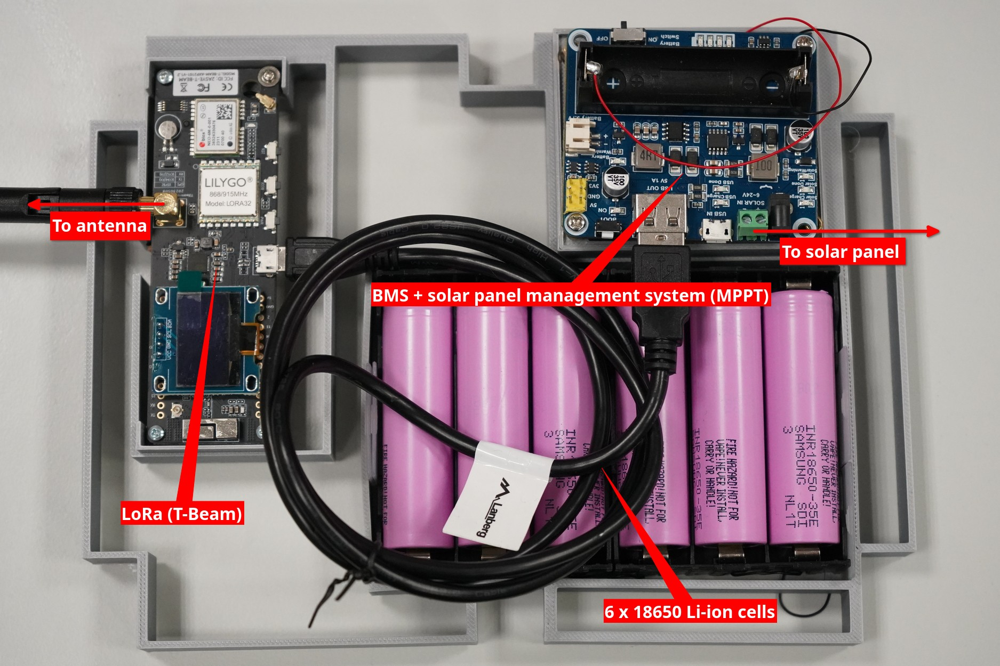

# Meshtastic node - MeshUJ1
# Authors 
- Maksymilian Podżorski
- Jan Skiba
# Description of the project 
Fully offgrid repeater/router working in Meshtastic network. Designed for deployment on the roof of WFAIS UJ or any other remote location. Would have a meaningful application in apocaliptic scenarios when all others communication systems would fail. Powered by a solar panel in sunny times and by a battery bank in not so sunny moments. Project includes used 3D models, guidelines for decreasing power consuption of the setup and mathematica notebook for estimating number of batteries you should use. There are also some photos for inspirational purposes.
# Science and tech used 
Science used:
- Classical Electrodynamics

Tech:
- Module ESP32 TTGO Meshtastic T-Beam V1.2 433Mhz from LilyGO
- 6x batteries 18650 3500 mAh (pink :) )
- 20 W solar panel
- BMS + solar panel management system combo (MPPT) (Waveshare 16120 - based on CS8501 and CN3791)
- Plastic box (IP65 or IP66 would be best)
- Coaxial cable SMA male-male
- 868 MHz antena
- SMA female to N female adapter (or something else that lets you connect your antena)
- Battery basket
- Cable seals for electrical boxes
- Micro USB to USB-A cable
- Some cables
- 3D printer
- Metal profiles
- M6 bolts, nuts and washers
- PLA fillament (but ASA would be better for outdoor use)
# State of the art 
Electrical components were connected according to connection_scheme.png. 3D models were done with help of Fusion 3D and tinkercad.com. Metal profiles were cut with metal saw and all holes in this project were done with a drill. Metal profiles were used to mount a solar pannel to 3D printed parts with M6 bolts, nuts and washers. Some soldering were requried with the used battery basket and in the making of the coaxial cable. 3D models were printed on Prusa MK3 and Creality K1.

T-Beam was flashed using official Meshtastic site (https://flasher.meshtastic.org). You can set it up using your smartphone with the help of their official app or by connecting you PC to it via micro USB cable (client.meshtastic.org). If you plan to do it with your smartphone set up everything as you wish before changing your T-Beam profile to repeater/router as it will turn off bluetooth, telemetry and internal screen (for more information refer to meshtastic documentation). The main difference between repeater and router is that repeater is not discoverable as a node. We choose to keep most of the default router mode settings. The things we changed were:
- setting GPS updates every 24h (could be even longer if you don't expect it to move)
- turning off ability to message this node (could be left on if you plan to control somethings via messages)
- turning Bluetooth on (so other admins could more easliy manage it)

# What next?
Some more work is requried in holder for electronics components (na_elementy.stl) as screwholes for MPPT don't align properly. In the future it would be nice to add additional power sources such as wind/rain turbine. Future contributors could add their own sensors (temperature, wind force/direction, rain, microparticles, scintilator counter) and program it to annouce the measured data to a private/public channel. A nice addition would be also to make this system relay official annoucment from goverment channels (from the internet or Alert RCB) to a special meshtastic channel.
# Sources 
- ...
